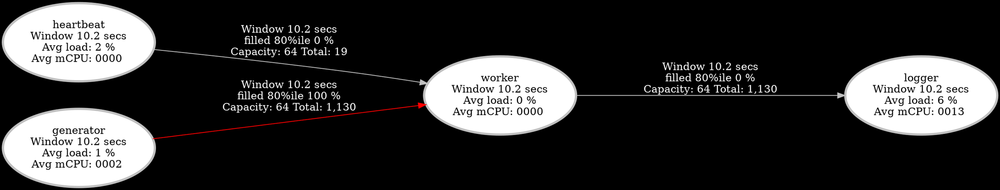

# Steady State Standard Project

A production-grade example of actor-based concurrent programming in Rust using the [`steady_state`](https://crates.io/crates/steady_state) framework.

This project builds on the minimal example and demonstrates real-world actor patterns:
- Multi-actor pipelines and message routing
- Timed batch coordination using heartbeat signals
- Persistent state across restarts
- Complex shutdown sequencing
- Observability with built-in metrics and Prometheus integration
- Comprehensive unit and integration testing patterns

---

## 🎯 Why This Example is "Standard"

This lesson moves beyond the minimal example and teaches production-capable actor system design.

It covers:
- Multi-actor coordination with distinct roles and inputs
- Timing-driven batch processing using shared signals
- Persistent actor state (survives panics and restarts)
- Real-time metrics, CPU usage, and system throughput
- Clean and coordinated shutdown logic
- Configurable alerting and dashboard integration
- Dual-mode testing (unit + graph)

**Built on**: The foundational concepts introduced in the minimal example—safe concurrency, isolated actors, and shutdown orchestration.

---

## 🎯 Overview

This project demonstrates advanced actor model features in a structured pipeline:

- **Generator** – continuously produces data with persistent state
- **Heartbeat** – sends timing signals and initiates graceful shutdown
- **Worker** – batches data on heartbeat events and applies processing logic (e.g. FizzBuzz)
- **Logger** – logs and finalizes messages without blocking upstream actors

Together, these actors form a real-world pipeline controlled by timing, backpressure, and safe concurrency.

---

## 🧠 Key Concepts

### Actor Specialization Patterns

| Actor Name | Purpose |
|------------|---------|
| **Generator** | Produces a stream of values and maintains a counter |
| **Heartbeat** | Emits periodic timing signals and triggers shutdown |
| **Worker** | Waits for signals + data, processes batches (e.g. FizzBuzz logic) |
| **Logger** | Outputs processed messages; demonstrates async side effects |

This modular approach simplifies debugging, upgrades, and testing—each actor is replaceable, testable, and independent.

---

### Persistent Actor State

Actors maintain internal state across failures. If an actor panics or crashes, its last known state is automatically restored using the `SteadyState<T>` wrapper.

Example use cases:
- Counters
- Retry tracking
- Long-lived processing state

This eliminates the need for external storage just to recover progress.  This is done in memory per actor while the application is running..

---

### Timed Batch Processing

The **Heartbeat** actor emits signals on a fixed interval (e.g., every 1 second). The **Worker** waits until:
1. A heartbeat signal is received
2. Data is available from the Generator
3. Output capacity is available to forward results

This design allows deterministic, load-sensitive batch behavior.

---

### Coordinated Shutdown Logic

The Heartbeat actor keeps a beat count and eventually requests system shutdown.

When shutdown is requested:
- Each actor finishes its in-progress work
- Channels are drained
- Final logs are flushed
- All actors confirm readiness before exiting

This clean, cooperative termination avoids data loss and partial computation.

---

### Backpressure Management

Actors use backpressure-aware methods like:
- `actor.wait_vacant()` – wait until output channel has room
- `actor.send_async(..., SendSaturation::AwaitForRoom)` – throttle producers

This prevents:
- Channel overflow
- Memory exhaustion
- Queue delays

and helps maintain predictable latency under load.

Review the macros await_for_all!() and await_for_any!() and their related macros.
Using them at the top of the is_running loop is the most common and readable approach to backpressure management.
With that we simply await for both new work and room to write it before we do anything.

---

### Monitoring and Observability

You can view:
- Actor CPU utilization (avg mCPU)
- Channel fill rates (backpressure)
- Message throughput
- Load per actor and per channel

This includes:
- **Telemetry dashboard** at `http://127.0.0.1:9900`
- **Prometheus metrics** at `http://127.0.0.1:9900/metrics`
- **DOT graph** of actor relationships at `http://127.0.0.1:9900/graph.dot`

These help answer questions like:
- Which actor is overloaded?
- Are any channels full? 
- What might the latency be?
- Is processing falling behind?

---

## 📋 Project Structure

- **generator.rs** – Stateful, backpressure-aware producer
- **heartbeat.rs** – Timing source and shutdown trigger
- **worker.rs** – Batch processor that responds to timing and input
- **logger.rs** – Passive consumer of completed results
- **main.rs** – Initializes actors, wires channels, starts system

---

## 🛠 Notable Features Introduced

| Feature                       | Description                                                                 |
|-------------------------------|-----------------------------------------------------------------------------|
| `SteadyState<T>`              | Actor-local state persisted across restarts                                 |
| `await_for_all!()`            | Wait for multiple conditions concurrently                                   |
| `actor.send_async(...).await` | Throttle messages based on downstream availability                          |
| `actor.is_running()`          | Coordinated shutdown condition checking                                     |
| `actor.request_shutdown()`    | Triggers system-wide cooperative shutdown                                   |
| `ScheduleAs::SoloAct`           | One thread per actor – safe and simple to reason about                      |

---

## 📊 Observing Actor Behavior

### Telemetry
- Dashboard: [http://127.0.0.1:9900](http://127.0.0.1:9900)
- DOT Graph: [http://127.0.0.1:9900/graph.dot](http://127.0.0.1:9900/graph.dot)



### Prometheus
- Metrics endpoint: [http://127.0.0.1:9900/metrics](http://127.0.0.1:9900/metrics)

```prometheus
avg_load{actor_name="heartbeat"} 2
avg_mCPU{actor_name="heartbeat"} 0
avg_load{actor_name="generator"} 2
avg_mCPU{actor_name="generator"} 2
avg_load{actor_name="worker"} 0
avg_mCPU{actor_name="worker"} 0
avg_load{actor_name="logger"} 6
avg_mCPU{actor_name="logger"} 17
inflight{from="heartbeat", to="worker"} 0
send_total{from="heartbeat", to="worker"} 22
take_total{from="heartbeat", to="worker"} 22
percentile_filled{from="heartbeat", to="worker", p=8000} 0
inflight{from="generator", to="worker"} 64
send_total{from="generator", to="worker"} 1386
take_total{from="generator", to="worker"} 1322
percentile_filled{from="generator", to="worker", p=8000} 100
inflight{from="worker", to="logger"} 0
send_total{from="worker", to="logger"} 1322
take_total{from="worker", to="logger"} 1322
percentile_filled{from="worker", to="logger", p=8000} 0
```

---

## 🚀 Running the App

```bash
cargo run -- --rate 500 --beats 60
```

Other modes:

- Fast mode: `cargo run -- --rate 100 --beats 20`
- Slow mode: `cargo run -- --rate 2000 --beats 5`
- Verbose logs: `RUST_LOG=info cargo run`

Output should include heartbeat, generated values, processed FizzBuzz messages, and system shutdown when all beats are completed.

---

## 🧪 Testing Framework

This project includes both **unit tests** and **integration tests**:

- **Unit**: Verify actor behavior in isolation (e.g., generator produces `0,1,2...`)
- **Integration**: Build full pipeline and run simulated end-to-end
- **Log-based assertions**: Ensure output and side effects match expectations

Run:
```bash
cargo test
```

---

## 🧭 Learning Path

This example is the second step in the Steady State learning journey:

1. **steady-state-minimal**: Intro to actors, timing, and shutdown
2. ✅ **steady-state-standard**: Production patterns and best practices
3. **steady-state-robust**: Panic recovery, retries, and fault isolation
4. **steady-state-performant**: High-throughput pipelines and message volume optimization
5. **steady-state-distributed**: Cluster-wide graphs and cross-node actor systems

Each example builds in complexity and capability—choose the right pattern based on your current project needs.
When reviewing the source code, look for //#!#// which demonstrate key ideas you need to know.
---

_The Steady State Standard project is your blueprint for building reliable, observable, and maintainable concurrent Rust systems using the actor model._
