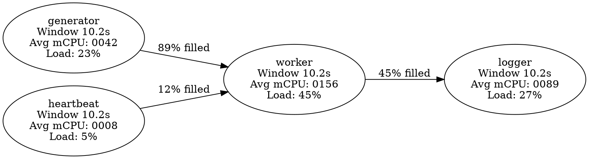

# Steady State Standard Example

A production-ready actor system demonstrating advanced concurrent programming patterns with the [`steady_state`](https://crates.io/crates/steady_state) framework. This example builds on the minimal foundation to show real-world patterns including state persistence, multi-actor coordination, batch processing, and comprehensive testing.

## 🎯 Why This Example is "Standard"

This lesson focuses on production-ready actor patterns:
- Multi-actor coordination and data flow pipelines
- Persistent state management across restarts
- Batch processing with timing control
- Comprehensive testing strategies
- Runtime configuration and monitoring

**Building on**: The minimal example's core concepts of actors, coordination, and shutdown.

## 🎯 Overview

This project demonstrates advanced features of actor-based architecture:

- **Multi-Actor Pipelines**: Coordinated data flow between specialized actors
- **State Persistence**: Actor state survives crashes and restarts
- **Batch Processing**: Timing-controlled bulk operations
- **Dual-Mode Testing**: Same code runs in production and test modes
- **Runtime Configuration**: Command-line arguments control behavior
- **Built-in Monitoring**: Performance metrics and alerting

## 🧠 Key Concepts

### Threading Model Evolution

| Minimal Example          | Standard Example           |
|--------------------------|----------------------------|
| Single actor demonstration | Multi-actor coordination |
| Basic timing patterns     | Complex flow control       |
| Simple shutdown           | Cooperative pipeline shutdown |
| Foundation concepts       | Production patterns        |

### Actor Specialization Patterns

- **Generator**: Continuous data production with persistent state
- **Heartbeat**: Timing control and lifecycle management
- **Worker**: Batch processing coordinator with multiple inputs
- **Logger**: Message consumption and side effect handling

### Advanced Coordination

- **Multi-Input Actors**: Workers coordinate between timing signals and data streams
- **Backpressure Management**: Automatic flow control prevents system overload
- **Graceful Pipeline Shutdown**: Messages drain completely before termination
- **State Recovery**: Persistent counters survive actor restarts

## 📋 System Architecture

```
Generator ──→ Worker ←── Heartbeat
                │
                ▼
              Logger
```

### Data Flow Components

**Generator Actor**
- Produces continuous data stream with incrementing values
- Maintains persistent state across restarts
- Demonstrates backpressure handling with `SendSaturation::AwaitForRoom`

**Heartbeat Actor**
- Controls system timing with configurable intervals
- Triggers batch processing in downstream actors
- Can initiate system-wide shutdown after configured beat count

**Worker Actor**
- Coordinates multiple input streams (generator data + heartbeat timing)
- Processes data in batches triggered by heartbeat signals
- Transforms data using business logic (FizzBuzz in this example)
- Demonstrates complex shutdown coordination

**Logger Actor**
- Consumes processed messages for output/storage
- Handles side effects without blocking the pipeline
- Shows event-driven processing patterns

### Notable APIs

- `SteadyState<T>` – Persistent actor state that survives restarts
- `await_for_all!()` – Coordinate multiple async conditions
- `cmd.take_into_iter()` – Efficient batch message processing
- `cmd.send_async()` – Backpressure-aware message sending
- `Threading::Spawn` – Dedicated thread per actor for isolation

### Advanced Features Demonstrated

#### Dual-Mode Operation
```rust
if cmd.use_internal_behavior {
    internal_behavior(cmd, channels, state).await
} else {
    cmd.simulated_behavior(vec!(&tx)).await
}
```

#### State Persistence
```rust
let mut state = state.lock(|| GeneratorState {value: 0}).await;
// State survives actor panics and restarts
```

#### Multi-Condition Coordination
```rust
await_for_all!(
    cmd.wait_avail(&mut heartbeat, 1),
    cmd.wait_avail(&mut generator, 1), 
    cmd.wait_vacant(&mut logger, 1)
);
```

### Observing Your Production Actor System

**Built-in Metrics**
- Load averaging, CPU utilization, channel fill rates

**Configurable Alerting**
- Threshold-based notifications for system health

**Statistical Monitoring**
- Percentile-based performance tracking

**Thread Isolation**
- Per-actor performance measurement

**Telemetry Dashboard**
- Telemetry: http://127.0.0.1:9900
- Graph: http://127.0.0.1:9900/graph.dot



**Prometheus Integration**
- Metrics: http://127.0.0.1:9900/metrics

```prometheus
# CPU utilization per actor
avg_mCPU{actor_name="generator"} 42
avg_mCPU{actor_name="heartbeat"} 8
avg_mCPU{actor_name="worker"} 156
avg_mCPU{actor_name="logger"} 89

# Load distribution 
load_avg{actor_name="generator"} 0.23
load_avg{actor_name="worker"} 0.45

# Channel utilization
filled_p80{channel="generator_to_worker"} 0.89
filled_p80{channel="heartbeat_to_worker"} 0.12
```

## 🚀 Running the App

```bash
# Default: 1 second intervals, 60 beats total
cargo run

# Fast mode: 100ms intervals, 20 beats
cargo run -- --rate 100 --beats 20

# Slow mode: 2 second intervals, 5 beats  
cargo run -- --rate 2000 --beats 5

# Run all tests including multi-threaded scenarios
cargo test

# Verbose logging to see detailed actor behavior
RUST_LOG=info cargo run
```

### Expected Output

```bash
Finished `dev` profile [unoptimized + debuginfo] target(s) in 2.34s
Running `target/debug/standard`
Telemetry on http://127.0.0.1:9900
Prometheus can scrape on http://127.0.0.1:9900/metrics
[2025-05-26 18:11:07.123] T[heartbeat] INFO Heartbeat 0 sent
[2025-05-26 18:11:07.124] T[logger] INFO Msg FizzBuzz
[2025-05-26 18:11:07.124] T[logger] INFO Msg Value(1) 
[2025-05-26 18:11:07.124] T[logger] INFO Msg Value(2)
[2025-05-26 18:11:07.125] T[logger] INFO Msg Fizz
...
[2025-05-26 18:12:06.891] T[heartbeat] INFO request shutdown
Process finished with exit code 0
```

## 🧪 Testing Framework

### Unit Testing

Each actor can be tested in isolation with deterministic behavior:

```rust
#[test]
fn test_generator() -> Result<(), Box<dyn Error>> {
    let mut graph = GraphBuilder::for_testing().build(MainArg::default());
    // Test individual actor behavior
    assert_steady_rx_eq_take!(generate_rx, vec!(0,1));
}
```

### Integration Testing

Stage managers orchestrate complex multi-actor scenarios:

```rust
#[test] 
fn graph_test() -> Result<(), Box<dyn Error>> {
    let stage_manager = graph.stage_manager();
    stage_manager.actor_perform(NAME_GENERATOR, StageDirection::Echo(15u64))?;
    stage_manager.actor_perform(NAME_LOGGER, StageWaitFor::Message(msg, timeout))?;
}
```

### Log Verification

Side effects can be verified through structured log capture:

```rust
#[test]
fn test_logger() -> Result<(), Box<dyn Error>> {
    let _guard = start_log_capture();
    // Run test scenario
    assert_in_logs!(["Msg Fizz"]);
}
```

## 🚀 Learning Path

Need to review fundamentals? Start with the Minimal Example to understand core actor concepts.

Ready for specialized patterns? Explore these examples in any order based on your needs:
- **steady-state-robust**: Specialized durable solutions defending against panics and failures
- **steady-state-performant**: High-throughput, low-latency optimization techniques
- **steady-state-distributed**: Spanning applications across pods, nodes, and networks

This standard example demonstrates the production-ready patterns you'll use in real applications: state management, multi-actor coordination, comprehensive testing, and runtime configuration. These patterns scale from simple utilities to complex distributed systems while maintaining deterministic, race-free behavior.
