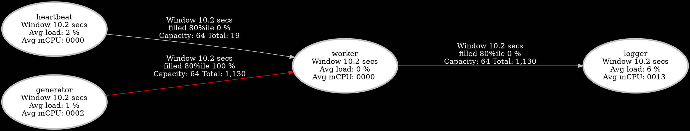

# Steady State Standard Project

A production-grade example of actor-based concurrent programming in Rust using the [`steady_state`](https://crates.io/crates/steady_state) framework.

This project builds on the minimal example and demonstrates real-world actor patterns:
- Multi-actor pipelines and message routing
- Timed batch coordination using heartbeat signals
- Persistent state across restarts
- Complex shutdown sequencing
- Observability with built-in metrics and Prometheus integration
- Comprehensive unit and integration testing patterns

---

## 🎯 Why This Example is "Standard"

This lesson moves beyond the minimal example and teaches production-capable actor system design.

It covers:
- Multi-actor coordination with distinct roles and inputs
- Timing-driven batch processing using shared signals
- Persistent actor state (survives panics and restarts)
- Real-time metrics, CPU usage, and system throughput
- Clean and coordinated shutdown logic
- Configurable alerting and dashboard integration
- Dual-mode testing (unit + graph)

**Built on**: The foundational concepts introduced in the minimal example—safe concurrency, isolated actors, and shutdown orchestration.

---

## 🎯 Overview

This project demonstrates advanced actor model features in a structured pipeline:

- **Generator** – continuously produces data with persistent state
- **Heartbeat** – sends timing signals and initiates graceful shutdown
- **Worker** – batches data on heartbeat events and applies processing logic (e.g. FizzBuzz)
- **Logger** – logs and finalizes messages without blocking upstream actors

Together, these actors form a real-world pipeline controlled by timing, backpressure, and safe concurrency.

---

## 🧠 Key Concepts

### Actor Specialization Patterns

| Actor Name | Purpose |
|------------|---------|
| **Generator** | Produces a stream of values and maintains a counter |
| **Heartbeat** | Emits periodic timing signals and triggers shutdown |
| **Worker** | Waits for signals + data, processes batches (e.g. FizzBuzz logic) |
| **Logger** | Outputs processed messages; demonstrates async side effects |

This modular approach simplifies debugging, upgrades, and testing—each actor is replaceable, testable, and independent.

---

### Persistent Actor State

Actors maintain internal state across failures. If an actor panics or crashes, its last known state is automatically restored using the `SteadyState<T>` wrapper.

Example use cases:
- Counters
- Retry tracking
- Long-lived processing state

This eliminates the need for external storage just to recover progress.  This is done in memory per actor while the application is running..

---

### Timed Batch Processing

The **Heartbeat** actor emits signals on a fixed interval (e.g., every 1 second). The **Worker** waits until:
1. A heartbeat signal is received
2. Data is available from the Generator
3. Output capacity is available to forward results

This design allows deterministic, load-sensitive batch behavior.

---

### Coordinated Shutdown Logic

The Heartbeat actor keeps a beat count and eventually requests system shutdown.

When shutdown is requested:
- Each actor finishes its in-progress work
- Channels are drained
- Final logs are flushed
- All actors confirm readiness before exiting

This clean, cooperative termination avoids data loss and partial computation.

---

### Backpressure Management

Actors use backpressure-aware methods like:
- `actor.wait_vacant()` – wait until output channel has room
- `actor.send_async(..., SendSaturation::AwaitForRoom)` – throttle producers

This prevents:
- Channel overflow
- Memory exhaustion
- Queue delays

and helps maintain predictable latency under load.

Review the macros await_for_all!() and await_for_any!() and their related macros.
Using them at the top of the is_running loop is the most common and readable approach to backpressure management.
With that we simply await for both new work and room to write it before we do anything.

---

### Monitoring and Observability

You can view:
- Actor CPU utilization (avg mCPU)
- Channel fill rates (backpressure)
- Message throughput
- Load per actor and per channel

This includes:
- **Telemetry dashboard** at `http://127.0.0.1:9900`
- **Prometheus metrics** at `http://127.0.0.1:9900/metrics`
- **DOT graph** of actor relationships at `http://127.0.0.1:9900/graph.dot`

These help answer questions like:
- Which actor is overloaded?
- Are any channels full? 
- What might the latency be?
- Is processing falling behind?

---

### Customizing Telemetry and Metrics

#### Metric Units
These structs define units for triggers and metrics, ensuring precise, type-safe configuration.

- **`Work`**: Represents workload as a percentage (0-100%, scaled to 0-10000 internally for precision).
    - Creation: `Work::new(value: f32) -> Option<Work>` (e.g., `Work::new(50.0)` for 50%).
    - Predefined: `Work::p10()`, `p20()`, ..., `p100()` (e.g., `Work::p50()` for 50%).
    - Usage: In actor load triggers (e.g., `Trigger::AvgAbove(Work::p80())`).
    - Telemetry/Prometheus: Appears in load metrics (e.g., `avg_load` as percentage).

- **`MCPU`**: Milli-CPUs (1-1024, where 1024 = 1 full core) for CPU usage.
    - Creation: `MCPU::new(value: u16) -> Option<MCPU>` (e.g., `MCPU::new(512)` for half a core).
    - Predefined: `MCPU::m16()`, `m64()`, `m256()`, `m512()`, `m768()`, `m1024()`.
    - Usage: In CPU triggers (e.g., `Trigger::AvgAbove(MCPU::m512())` for >50% CPU).
    - Telemetry/Prometheus: In CPU metrics (e.g., `avg_mCPU` in milli-units).

- **`Percentile`**: Defines distribution points for metrics (0-100%).
    - Creation: `Percentile::new(value: f64) -> Option<Percentile>` or `Percentile::custom(value)`.
    - Predefined: `Percentile::p25()`, `p50()`, `p75()`, `p80()`, `p90()`, `p96()`, `p99()`.
    - Usage: In builder methods like `with_mcpu_percentile(Percentile::p90())`.
    - Telemetry/Prometheus: Adds fields like `percentile_load{p=9000}` (p=percentile*100).

- **`Rate`**: Rate of events over time (e.g., messages/sec), as a rational for precision.
    - Creation: `Rate::per_millis(units)`, `per_seconds()`, `per_minutes()`, `per_hours()`, `per_days()` (e.g., `Rate::per_seconds(100)` for 100/sec).
    - Usage: In channel rate triggers (e.g., `Trigger::AvgAbove(Rate::per_seconds(500))`).
    - Telemetry/Prometheus: In rate metrics (e.g., `avg_rate` in items/sec).

- **`Filled`**: Channel fill level, as percentage or exact count.
    - Creation: `Filled::percentage(value: f32) -> Option<Filled>` or `Filled::exact(value: u64)`.
    - Predefined: `Filled::p10()`, `p20()`, ..., `p100()` (percentages).
    - Usage: In fill triggers (e.g., `Trigger::AvgAbove(Filled::p80())` for >80% full).
    - Telemetry/Prometheus: In fill metrics (e.g., `avg_filled` as percentage or count).

#### Triggers and Alerts
Triggers (`Trigger<T>`) define conditions for alerts, using units above. Types:
- `Trigger::AvgAbove(value)`: Alert if average exceeds value.
- `Trigger::AvgBelow(value)`: Alert if average falls below value.
- Colors: `AlertColor::Red` (critical), `Orange` (warning), `Yellow` (caution), `Green` (normal).

#### Computation and Formatting
Internally, `compute_labels` formats metrics for display:
- Handles avg/min/max, std dev, percentiles.
- Adjusts for frame rate/window.
- Outputs to telemetry strings and Prometheus (if enabled).
- Custom: Extend via `ComputeLabelsConfig` or override in subclasses for bespoke formatting.

### Customizing Actor Telemetry
Use `Graph::actor_builder()` to start, then chain `with_*` methods. Focus on CPU/load for actors.

#### Examples
```rust
let actor_builder = graph.actor_builder()
    .with_mcpu_avg()  // Add avg_mCPU metric
    .with_load_avg()  // Add avg_load metric
    .with_mcpu_percentile(Percentile::p90())  // 90th percentile CPU
    .with_load_percentile(Percentile::p99())  // 99th percentile load
    .with_mcpu_trigger(Trigger::AvgAbove(MCPU::m512()), AlertColor::Red)  // Red alert >50% CPU
    .with_load_trigger(Trigger::AvgAbove(Work::p80()), AlertColor::Orange)  // Orange >80% load
    .with_thread_info()  // Show thread/core
    .with_compute_refresh_window_floor(Duration::from_secs(1), Duration::from_secs(20));  // 1s refresh, 20s window
```

- **Telemetry Display**: Dashboard shows rows like "Avg mCPU: 300", "90%ile mCPU: 450", with colors for triggers.
- **Prometheus**: Metrics like `avg_mCPU{actor_name="worker"} 300`, `percentile_mCPU{p=9000} 450`. Set alerts in Prometheus config.
- **Customization Tips**: Add multiple percentiles for detailed distributions. Use `with_no_refresh_window()` for low-overhead actors.

### Customizing Channel Telemetry
Use `Graph::channel_builder()` to start. Focus on fill, rate, latency for channels.

#### Examples
```rust
let channel_builder = graph.channel_builder()
    .with_capacity(1024)  // Set buffer size
    .with_avg_filled()  // Avg fill %
    .with_filled_max()  // Max fill
    .with_avg_rate()  // Avg msg/sec
    .with_rate_max()  // Max rate
    .with_avg_latency()  // Avg latency ms
    .with_latency_max()  // Max latency
    .with_filled_percentile(Percentile::p80())  // 80th percentile fill
    .with_rate_percentile(Percentile::p95())  // 95th percentile rate
    .with_latency_percentile(Percentile::p99())  // 99th percentile latency
    .with_filled_trigger(Trigger::AvgAbove(Filled::p90()), AlertColor::Red)  // Red >90% full
    .with_rate_trigger(Trigger::AvgBelow(Rate::per_seconds(100)), AlertColor::Yellow)  // Yellow <100/sec
    .with_latency_trigger(Trigger::AvgAbove(Duration::from_millis(50)), AlertColor::Orange)  // Orange >50ms
    .with_compute_refresh_window_floor(Duration::from_secs(2), Duration::from_secs(30));  // 2s refresh, 30s window
```

- **Telemetry Display**: Rows like "Avg filled: 60%", "80%ile rate: 150/sec", with alerts coloring edges in DOT graph.
- **Prometheus**: Metrics like `avg_filled{from="gen", to="worker"} 60`, `percentile_rate{p=9500} 150`. Use for Grafana panels.
- **Customization Tips**: For high-throughput, add std devs (e.g., `with_rate_standard_deviation(StdDev::one())`) for variability. Use `with_no_refresh_window()` for silent channels.

### Advanced Customization
- **Standard Deviations**: Add with `with_*_standard_deviation(StdDev::one())` or `StdDev::two()` for variability metrics (e.g., `std_dev_rate` in Prometheus).
- **Remote/Distributed**: Use internal `with_remote_details` for labels like `ips`, `direction`.
- **Extending Metrics**: Subclass `ActorMetaData`/`ChannelMetaData` for custom fields, then expose via `compute_labels` overrides. Add to Prometheus via custom collectors.
- **Performance**: More metrics increase overhead; profile with tools like `cargo flamegraph`. Set longer windows for smoother aggregates.

For code examples, refer to lessons like `steady-state-standard`. If issues arise, check logs for "InternalError" in histograms.

---

## 📋 Project Structure

- **generator.rs** – Stateful, backpressure-aware producer
- **heartbeat.rs** – Timing source and shutdown trigger
- **worker.rs** – Batch processor that responds to timing and input
- **logger.rs** – Passive consumer of completed results
- **main.rs** – Initializes actors, wires channels, starts system

---

## 🛠 Notable Features Introduced

| Feature                       | Description                                                                 |
|-------------------------------|-----------------------------------------------------------------------------|
| `SteadyState<T>`              | Actor-local state persisted across restarts                                 |
| `await_for_all!()`            | Wait for multiple conditions concurrently                                   |
| `actor.send_async(...).await` | Throttle messages based on downstream availability                          |
| `actor.is_running()`          | Coordinated shutdown condition checking                                     |
| `actor.request_shutdown()`    | Triggers system-wide cooperative shutdown                                   |
| `ScheduleAs::SoloAct`           | One thread per actor – safe and simple to reason about                      |

---

## 📊 Observing Actor Behavior

### Telemetry
- Dashboard: [http://127.0.0.1:9900](http://127.0.0.1:9900)
- DOT Graph: [http://127.0.0.1:9900/graph.dot](http://127.0.0.1:9900/graph.dot)


```dot
digraph G {
rankdir=LR;
graph [nodesep=.5, ranksep=2.5];
node [margin=0.1];
node [style=filled, fillcolor=white, fontcolor=black];
edge [color=white, fontcolor=white];
graph [bgcolor=black];
"heartbeat" [label="heartbeat
Window 10.2 secs
Avg load: 2 %
Avg mCPU: 0000 
", color=grey, penwidth=3 ];
"generator" [label="generator
Window 10.2 secs
Avg load: 1 %
Avg mCPU: 0002 
", color=grey, penwidth=3 ];
"worker" [label="worker
Window 10.2 secs
Avg load: 0 %
Avg mCPU: 0000 
", color=grey, penwidth=3 ];
"logger" [label="logger
Window 10.2 secs
Avg load: 6 %
Avg mCPU: 0013 
", color=grey, penwidth=3 ];
"heartbeat" -> "worker" [label="Window 10.2 secs
filled 80%ile 0 %
Capacity: 64 Total: 19
", color=grey, penwidth=1];
"generator" -> "worker" [label="Window 10.2 secs
filled 80%ile 100 %
Capacity: 64 Total: 1,130
", color=red, penwidth=1];
"worker" -> "logger" [label="Window 10.2 secs
filled 80%ile 0 %
Capacity: 64 Total: 1,130
", color=grey, penwidth=1];
}
```

### Prometheus
- Metrics endpoint: [http://127.0.0.1:9900/metrics](http://127.0.0.1:9900/metrics)

```prometheus
avg_load{actor_name="heartbeat"} 2
avg_mCPU{actor_name="heartbeat"} 0
avg_load{actor_name="generator"} 2
avg_mCPU{actor_name="generator"} 2
avg_load{actor_name="worker"} 0
avg_mCPU{actor_name="worker"} 0
avg_load{actor_name="logger"} 6
avg_mCPU{actor_name="logger"} 17
inflight{from="heartbeat", to="worker"} 0
send_total{from="heartbeat", to="worker"} 22
take_total{from="heartbeat", to="worker"} 22
percentile_filled{from="heartbeat", to="worker", p=8000} 0
inflight{from="generator", to="worker"} 64
send_total{from="generator", to="worker"} 1386
take_total{from="generator", to="worker"} 1322
percentile_filled{from="generator", to="worker", p=8000} 100
inflight{from="worker", to="logger"} 0
send_total{from="worker", to="logger"} 1322
take_total{from="worker", to="logger"} 1322
percentile_filled{from="worker", to="logger", p=8000} 0
```

---

## 🚀 Running the App

```bash
cargo run -- --rate 500 --beats 60
```

Other modes:

- Fast mode: `cargo run -- --rate 100 --beats 20`
- Slow mode: `cargo run -- --rate 2000 --beats 5`
- Verbose logs: `RUST_LOG=info cargo run`

Output should include heartbeat, generated values, processed FizzBuzz messages, and system shutdown when all beats are completed.

---

## 🧪 Testing Framework

This project includes both **unit tests** and **integration tests**:

- **Unit**: Verify actor behavior in isolation (e.g., generator produces `0,1,2...`)
- **Integration**: Build full pipeline and run simulated end-to-end
- **Log-based assertions**: Ensure output and side effects match expectations

Run:
```bash
cargo test
```

---

## 🧭 Learning Path

This example is the second step in the Steady State learning journey:

1. **steady-state-minimal**: Intro to actors, timing, and shutdown
2. ✅ **steady-state-standard**: Production patterns and best practices
3. **steady-state-robust**: Panic recovery, retries, and fault isolation
4. **steady-state-performant**: High-throughput pipelines and message volume optimization
5. **steady-state-distributed**: Cluster-wide graphs and cross-node actor systems

Each example builds in complexity and capability—choose the right pattern based on your current project needs.
When reviewing the source code, look for //#!#// which demonstrate key ideas you need to know.
---

_The Steady State Standard project is your blueprint for building reliable, observable, and maintainable concurrent Rust systems using the actor model._
